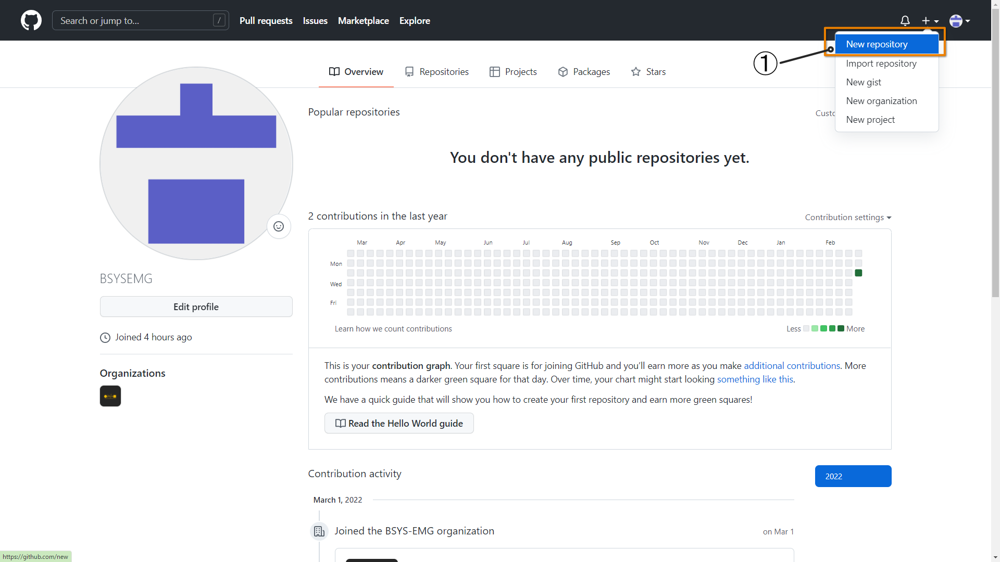
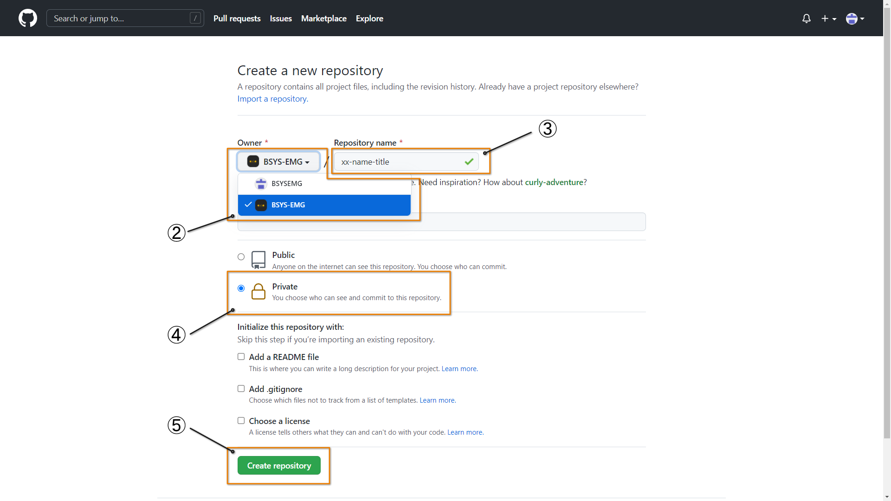
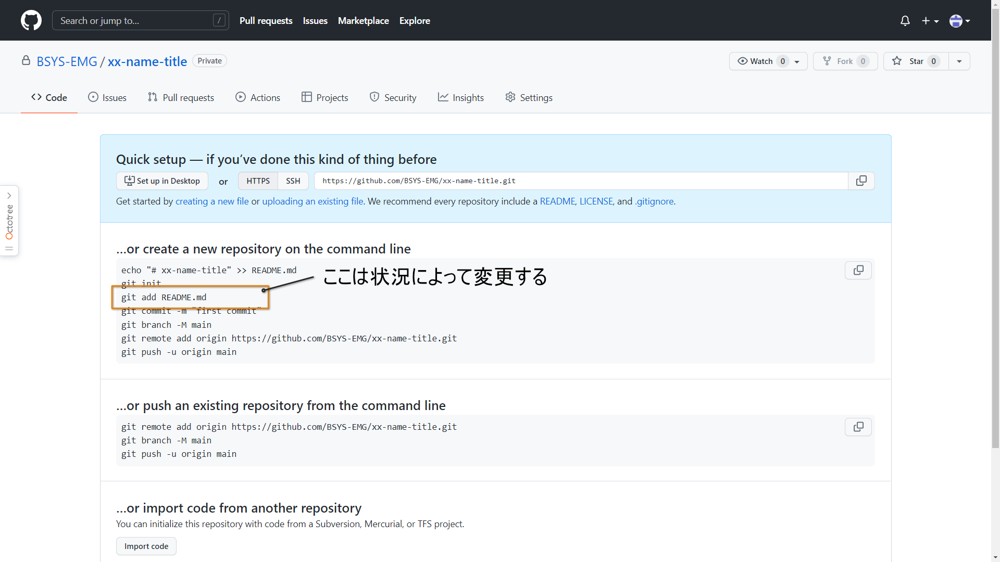

# BSYS GitHub
作成中<br>

## GitHubとは？
超ざっくり説明すると**ソースコード**をオンラインで管理する手段．<br>
ソースコードの管理が前提なので実験データ（画像やcsvファイル）やキャッシュ，外部ライブラリなど容量の大きいファイルは上げない．<br>

## Gitでの管理方法（基礎の基礎）
ここではとりあえずGitにソースコードを保存するためだけの操作を紹介する．<br>
保存先のbrunchを変更や特定のファイルのみの更新はとりあえず考えない．<br>

### Step1：リポジトリを作る
<br>
① 画像にあるように"New repository"を開く<br>
<br>
② Ownerを個人から**BSYS-EMG**に変更する．<br>
③ 「卒業年-名前-タイトル」と名前を付ける<br>
④ 研究室内のみでの共有なので**Private**とする<br>
⑤ レポジトリを作成<br>

このような画面が出てきていれば作成完了<br>

次にGitHubに上げないファイルを.gitignoreに追加

```bash
venv
__pycache__
.ipynb_checkpoints
.npy
.pth
```

### Step2. GitHubにアップロードする

```bash
git add -A
git commit -m "first commit"
git branch -M main
git remote add origin https://github.com/BSYS-EMG/xx-name-title.git
git push -u origin main
```

このときに容量の大きいファイル（機械学習の学習済み重みや入力データなど）が含まれているとエラーが起きるので注意

### Step3. 変更点をアップロード

```bash
git add -A
git commit -m "hogehoge"
git push
```

### Step4. 他の端末で更新した変更点を取得してマージ

```bash
git stash -u
git pull origin [remote_branch]
```

### Step5. ブランチを作成

```bash
git branch [branch_name]
git checkout [branch_name]
```

### Step6. ブランチに変更点をマージ

```bash
git stash -u
git pull origin [remote_branch]:[local_branch]
```

--
